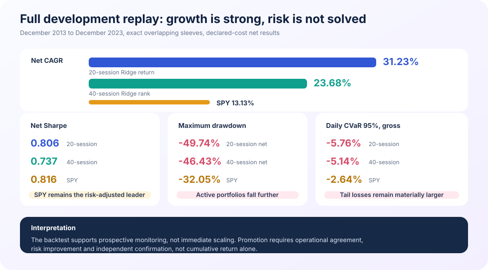
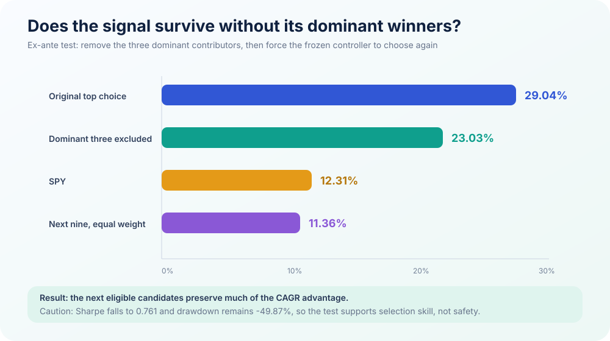
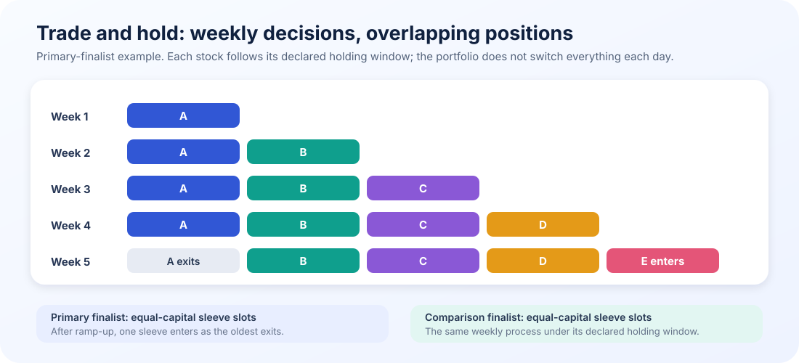
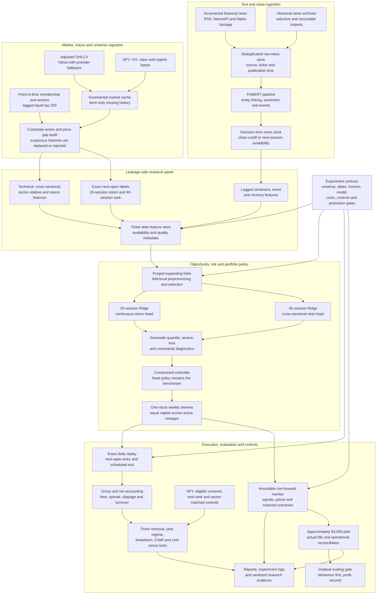
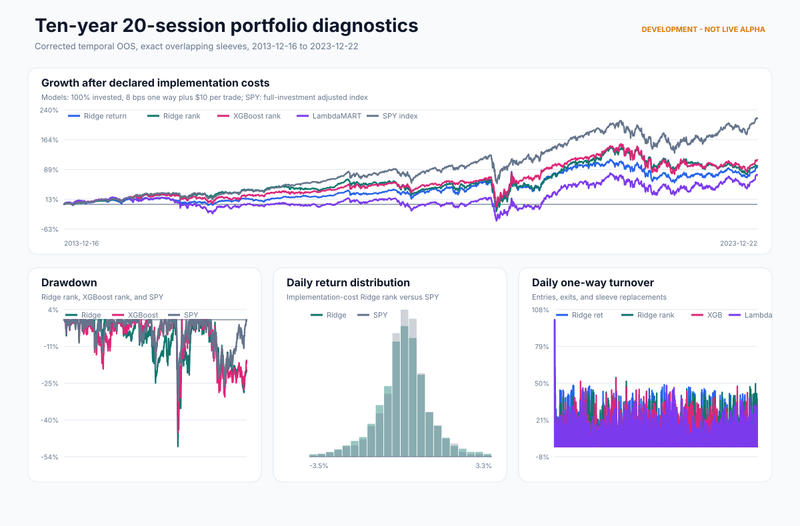
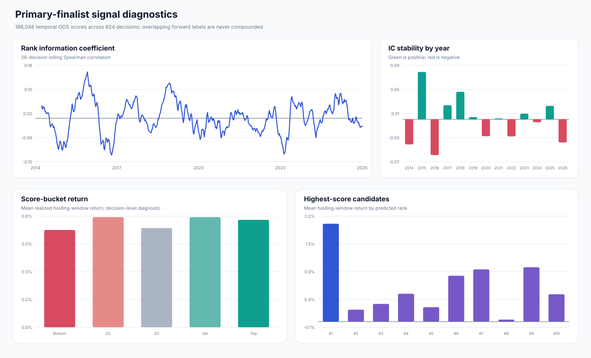
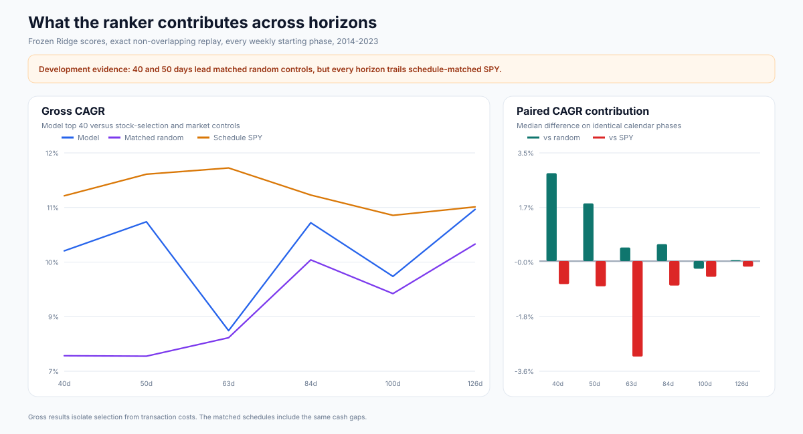
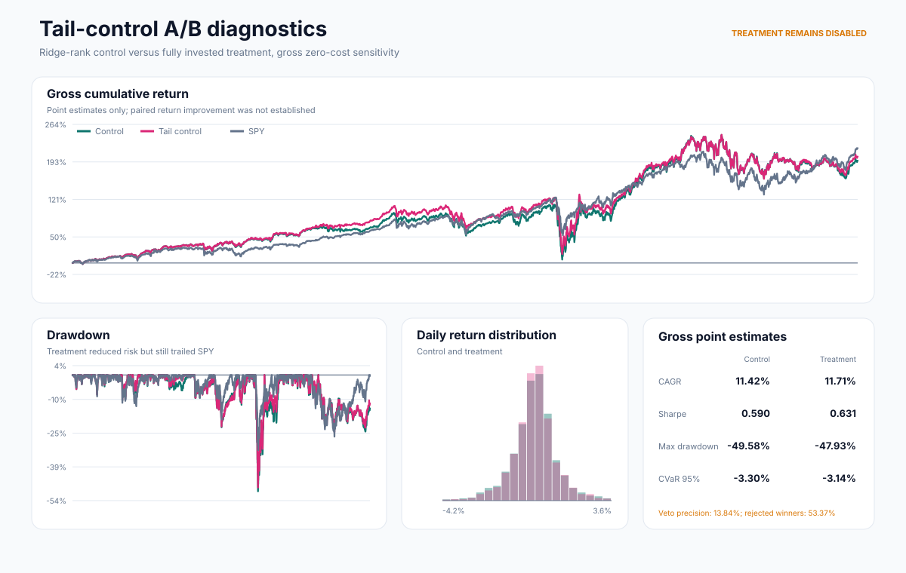
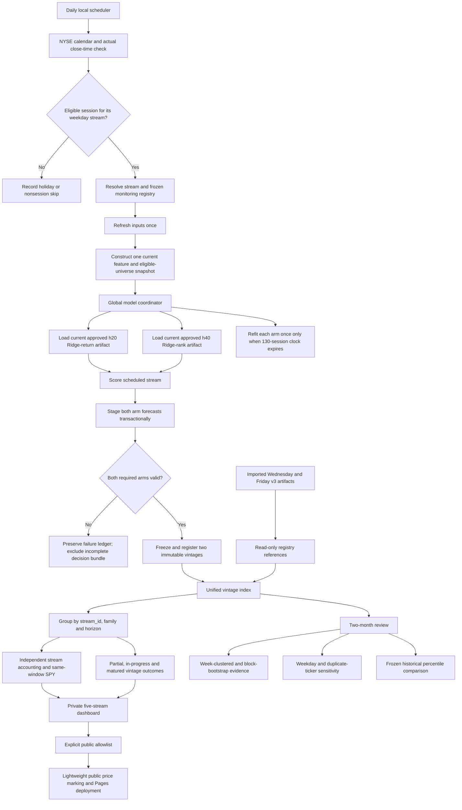

# AI-Driven Stock Selection Research Showcase

> Can a machine-learning model identify future stock-market winners without
> relying on one lucky ticker, one favourable period, or a backtest assumption
> that disappears in live operation?

## The result that moved the project forward

The current research candidate opens one new stock sleeve each week and holds
each selection for an exact horizon. In the corrected ten-year development
replay, the strongest candidate produced a 34.84% gross CAGR. When its three
largest historical contributors were excluded before selection, the frozen
model chose the next eligible candidates and still produced a 23.03% gross
CAGR.

| Development CAGR | Ex-ante exclusion CAGR | Weekly OOS decisions | Automated checks |
|---:|---:|---:|---:|
| **34.84%** | **23.03%** | **520** | **309** |
| Strongest finalist | Dominant contributors unavailable | December 2013 to December 2023 | Data, model, execution and publishing |

The result is promising because the ranking signal survives a direct attack on
its strongest winners. It is not yet ready to scale: its drawdown and tail
losses remain larger than SPY. The project has therefore moved from historical
development to live-forward monitoring.

## How the project evolved

The first version combined return prediction, technical indicators, sentiment,
portfolio optimization and pair trading. Successively stricter experiments
changed the direction:

1. point-in-time, execution and corporate-action audits removed results that
   could not be reproduced safely;
2. selecting relative winners proved more useful than forecasting an exact
   return;
3. simple linear models remained difficult for complex rankers to beat on a
   common temporal evaluation;
4. average broad-portfolio signals did not adequately control drawdown and
   tail losses;
5. breadth analysis found the strongest information near the very top of the
   ranking; and
6. an ex-ante contributor-exclusion test showed that the model could move to
   its next candidate rather than depending entirely on a few historical
   winners.

## Full development comparison

Every portfolio below uses the same daily calendar, overlapping-sleeve
accounting and SPY reference.

| Metric | 20-session return model | 40-session rank model | SPY |
|---|---:|---:|---:|
| Gross cumulative return | 3,508.26% | 1,487.79% | 339.19% |
| Gross CAGR | 34.84% | 25.92% | 13.13% |
| Gross annualized volatility | 46.83% | 38.80% | 16.87% |
| Gross Sharpe | 0.864 | 0.784 | 0.816 |
| Gross maximum drawdown | -49.24% | -46.16% | -32.05% |
| Daily CVaR 95% | -5.76% | -5.14% | -2.64% |
| Worst day | -15.18% | -20.92% | -8.80% |
| Net cumulative return | 2,504.88% | 1,180.08% | 339.19% |
| Net CAGR | 31.23% | 23.68% | 13.13% |
| Net Sharpe | 0.806 | 0.737 | 0.816 |
| Net maximum drawdown | -49.74% | -46.43% | -32.05% |

Net results use a declared-cost sensitivity with $1 million starting capital,
8 basis points of one-way execution cost and $10 per order. Both candidates
compound faster than SPY in development, but SPY retains the strongest net
Sharpe and materially smaller drawdown.

## Does the signal survive without its best winners?

The exclusion test supports a ranking relationship, not a safety claim. After
the dominant contributors were made unavailable, gross CAGR remained 23.03%,
but Sharpe fell to 0.761 and maximum drawdown remained -49.87%.

## Trade and hold, not daily replacement

The strategy makes one decision each week, enters at the declared execution
time, and holds that sleeve until its exact exit. A 20-session strategy builds
toward four concurrent weekly sleeves; a 40-session strategy builds toward
eight. Capital is divided across active sleeve slots, so each weekly selection
contributes without being counted as a separate fully invested portfolio.

## Architecture

| Module | Responsibility |
|---|---|
| Market and news ingestion | Refresh adjusted prices and timestamped news; retain effective-dated membership, sector and source metadata |
| Data integrity | Audit freshness, corporate actions, missing histories, decision-time availability and survivorship controls |
| Leakage-safe research panel | Build the lagged liquid universe, features and exact next-open horizon labels |
| Model development | Run purged temporal folds, fold-local preprocessing and feature selection, training-only early stopping and Optuna TPE |
| Portfolio construction | Convert frozen scores into holdings while tracking exposure, liquidity, turnover, downside and uncertainty |
| Execution replay | Apply exact entry timing, overlapping sleeves, costs, cash and schedule-matched SPY |
| Monitoring and evidence | Preserve immutable forecasts, mature outcomes without look-ahead and publish sanitized diagnostics |

The implementation, production configuration, trained models, data, current
selections and live execution records are intentionally private.

## Evidence gallery

| Portfolio and execution diagnostics | Signal diagnostics |
|---|---|
|  |  |

| Horizon attribution | Tail-control experiment |
|---|---|
|  |  |

These figures use the frozen 20-session Ridge-return finalist that produced a
34.84% gross CAGR. Signal diagnostics use temporal out-of-sample predictions;
portfolio charts use exact daily overlapping-sleeve accounting.

## From research to capital

| Stage | Purpose | Promotion requirement |
|---|---|---|
| Historical development | Find and challenge a repeatable signal | Temporal OOS controls, exact execution replay and stress tests |
| Live-forward monitoring | Observe frozen decisions for at least two months | Signals, assumed prices, turnover, risk and accounting agree with the backtest |
| Small pilot | Test the operational path with approximately $4,000 | Real fills, slippage, costs and interventions stay within frozen tolerances |
| Gradual scaling | Increase capital carefully | Operational agreement continues; profit alone cannot unlock scaling |

Read the [research standard](docs/RESEARCH_STANDARD.md) and
[live validation plan](docs/LIVE_VALIDATION_PLAN.md).

### Five-stream prospective monitoring pipeline

The next monitoring phase separates weekday entry timing from model training. All
five streams share the same approved model artifact for each arm, while every
vintage keeps its own immutable decision, execution and benchmark record.

The holding-period clock is now explicit: `20 sessions` and `40 sessions` mean
completed NYSE open-to-open intervals, not calendar days or generic business
days. The decision session does not count; entry is the next actual NYSE open;
weekends and full-market holidays do not count; and a valid early-close session
does count. The stock and SPY always use the same entry and maturity opens.

A named weekday stream runs only when that civil weekday is an actual NYSE
session. If the exchange is closed, that week's vintage is recorded as skipped
and is never shifted, backfilled, or silently inserted on another weekday. An
early close may be scored only after the actual close plus the settlement
buffer. Missing required stock or SPY opens fail closed, and partial marks never
enter mature horizon statistics.

This also corrects a legacy expectation: generic business-day arithmetic placed
the August 12 and August 14 seed maturities one NYSE session too early across
Labor Day. Their immutable source files remain unchanged; the monitoring
registry records corrected h20 maturities of September 11 and September 15,
and h40 maturities of October 9 and October 13, 2026.

The first completed interval can validate pipeline operation, but not model
effectiveness. All five streams can be operationally checked after roughly one
eligible week; the first h20 outcome needs about four to five calendar weeks;
and the two-month review is still only preliminary for h20 and early-stage for
h40. The first formal gate requires 60 mature outcomes—about 16 calendar weeks
at five decisions per week after the maturity lag—with an effective sample size
smaller than the raw count because vintages overlap.

The current one-interval checkpoint therefore makes no profitability claim:
there are zero mature outcomes. It records APP h20 at +1.89% active versus SPY
and BAC h40 at -2.25% active versus SPY as diagnostics only. The legacy
Wednesday and Friday seeds also have different model hashes, so the
same-artifact comparison begins only after the shared model coordinator is
deployed prospectively.

### Fastest code-validation and pilot schedule

This schedule is for implementation reconciliation, not accelerated proof of
profitability. It assumes the provenance-enabled code and shared-model
coordinator are deployed before the relevant decision close and every
fail-closed check passes.

| Date | Checkpoint | Evidence allowed |
|---|---|---|
| August 17, 2026, after NYSE close plus buffer | Freeze the first provenance-enabled Monday h20/h40 bundle | Exact feature, eligibility, model, configuration and calendar hashes |
| August 18, 2026, market open | Reconcile the declared next-open entry and schedule-matched SPY prices | Entry-path and broker/data plumbing validation |
| August 19, 2026, market open | Reconcile the first completed open-to-open interval | Provenance portion of the implementation-parity gate may pass |
| Approximately one eligible week | Observe every weekday stream with one shared model artifact per arm | Five-stream operational gate may pass |
| September 11, 2026 | First corrected h20 seed maturity | One complete h20 lifecycle; not profitability proof |
| October 9, 2026 | First corrected h40 seed maturity | One complete h40 lifecycle; not profitability proof |

No old forecast is backfilled with evidence that was not frozen when it was
created. A tiny controlled execution canary may be considered only after the
provenance, shared-model, coordinated-stream, next-open, duplicate-order, capital
limit and kill-switch checks all pass. Broader pilot or scaling decisions remain
subject to the predeclared performance and risk gates.

## What this public repository intentionally excludes

- source code and production configurations;
- feature lists, model parameters and policy thresholds;
- raw or processed datasets and licensed inputs;
- trained models, Optuna studies and prediction panels;
- current holdings, scores, weights and rebalance targets;
- brokerage records, credentials and operational logs; and
- stock-level live evidence before it is safe to disclose.

## Disclaimer

This repository presents educational research evidence. Backtests and
live-forward observations are not investment advice and do not guarantee future
performance.
